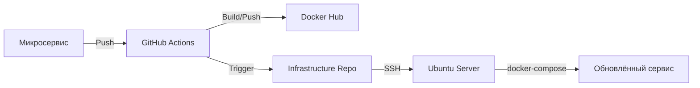

# Архитектура инфраструктуры с CI/CD на GitHub Actions + Docker Compose

Наша инфраструктура микросервисов построена по следующей схеме:

1. Индивидуальные репозитории сервисов:
Каждый микросервис располагается в собственном Git-репозитории. При коммите в основную ветку автоматически собирается Docker-образ и публикуется в Docker Hub.
2. Центральный репозиторий инфраструктуры:
Содержит основной docker-compose.yml для production-окружения. Описывает всю систему микросервисов и их взаимодействие.Управляет версиями образов из Docker Hub.
На Ubuntu приложение разворачиваем посредством билда docker compose, спулливая образы всех сервисов (backend, frontend) из Docker Hub.

### 1. Компоненты
- **Микросервисы**:
  - Каждый сервис — независимый проект (отдельные репозитории)
  - Автономная сборка и публикация образов
  - Примеры: `modula-core-builder`, `google`, `modula-core-processor`

- **Infrastructure-репозиторий**:
  - Содержит основной `docker-compose.yml` для production
  - Управляет взаимодействием сервисов
  - Центральная точка деплоя

- **Сервисы интеграций/ modula-platform**:
  - Для создания новой интеграции предлагается форкнуться от templat`а https://github.com/ERP-Modula/modula-platform
  - Шаблон содержит ci/cd, которые необходимо доработать, учитывая интеграцию, которую реализует разработчик
  - Шаблон содержит подключенную общую библиотеку https://github.com/ERP-Modula/common-lib, которая лежит в github packages.
  
### 2. Схема работы

### Содержание

1. [Архитектурные диаграммы](./diagram/readme.md)
